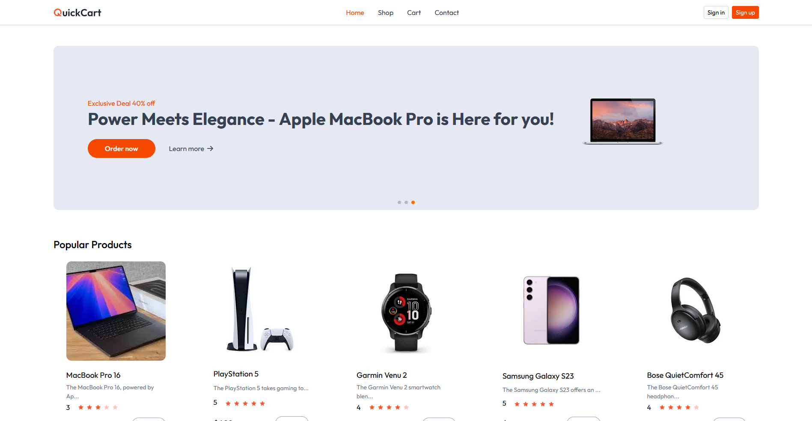
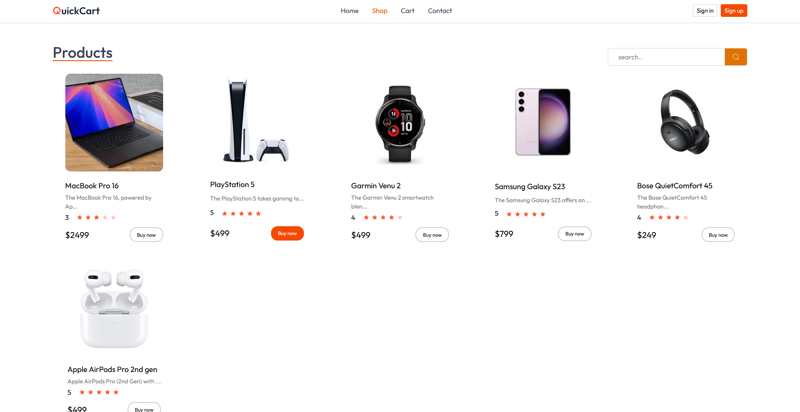
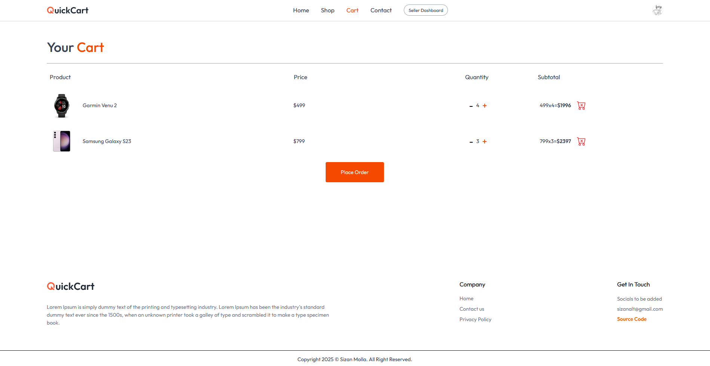
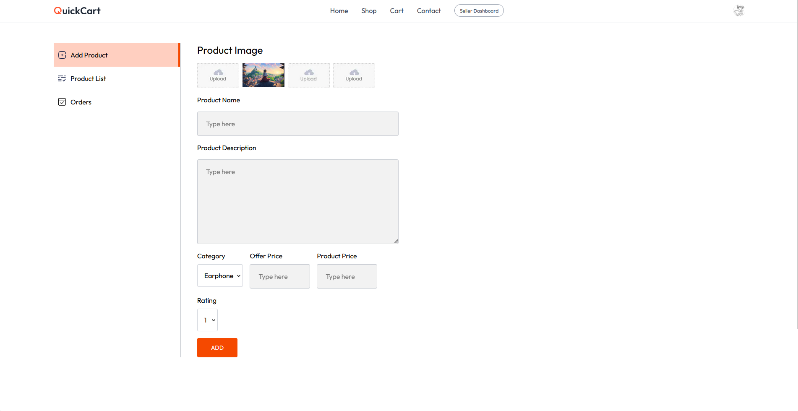
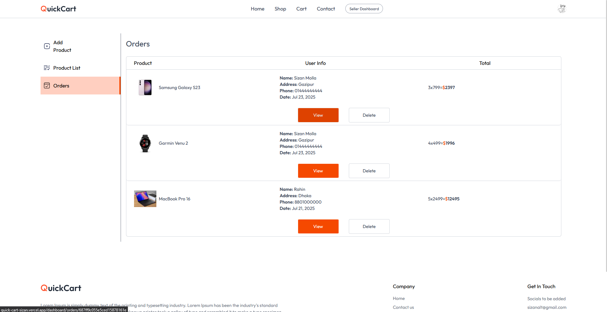

# 📌 QuickCart - E-Commerce Platform

QuickCart is a modern e-commerce application built with Next.js (full-stack), MongoDB, and Tailwind CSS. It allows customers to browse and place orders, and sellers to manage their products through a dedicated dashboard.  

> ⚠️ Note: Payments are not online yet; orders can be placed but manual payment is required.  

---

## 🌐 Live Demo

[**Click here**](https://quick-cart-sizan.vercel.app/)  

---

## Preview

### Customer Site

<p align="center">
  
  
  
</p>

### Seller Dashboard

<p align="center">
  
  
</p>

---

## 🚀 Features

- 🛍️ Browse and add products to cart 

- 📦 Place orders (manual payment)  

- 👨‍💼 Seller dashboard for product and order management  

- 🔒 Authentication with Clerk  

- 💻 Responsive UI with Tailwind CSS  

---

## 🛠️ Tech Stack

- **Frontend & Backend:** Next.js (Full-stack)  

- **Database:** MongoDB  

- **Styling:** Tailwind CSS  

- **Authentication:** Clerk  

- **Local Testing / Tunneling:** Ngrok  

---

## ⚙️ Installation & Setup

#### Clone the repo:

```bash
git clone https://github.com/sizan14789/QuickCart.git
```
#### setup env:

```ini
MONGO=<your_mongodb_uri>
BASE_URL=http://localhost:3000

NEXT_PUBLIC_CLERK_PUBLISHABLE_KEY=<your clerk publishable key>
CLERK_SECRET_KEY=<your clerk secret key>

WEBOOK_SECRET=<your webhook secret>
CLERK_WEBHOOK_SIGNING_SECRET=<your webhook signing secret>

CLOUDINARY_CLOUD_NAME=<your cloud name>
CLOUDINARY_API_KEY=<your api key>
CLOUDINARY_API_SECRET=<your api secret>
```
#### Run:

```
npm i; npm run dev
```